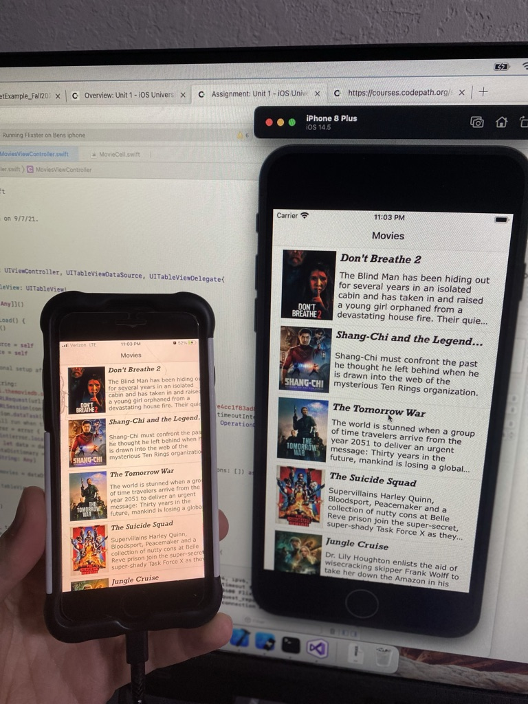

# Flixster

Flixster is an app that allows users to browse movies from the [The Movie Database API](http://docs.themoviedb.apiary.io/#).

📝 `NOTE - PASTE PART 2 SNIPPET HERE:` Paste the README template for part 2 of this assignment here at the top. This will show a history of your development process, which users stories you completed and how your app looked and functioned at each step.

---

## Flixster Part 1

### User Stories

#### REQUIRED (10pts)
- [X] (2pts) User sees an app icon on the home screen and a styled launch screen.
- [X] (5pts) User can view and scroll through a list of movies now playing in theaters.
- [X] (3pts) User can view the movie poster image for each movie.

#### BONUS
- [ ] (2pt) User can view the app on various device sizes and orientations.
- [X] (1pt) Run your app on a real device.
 

### App Walkthrough GIF

 

